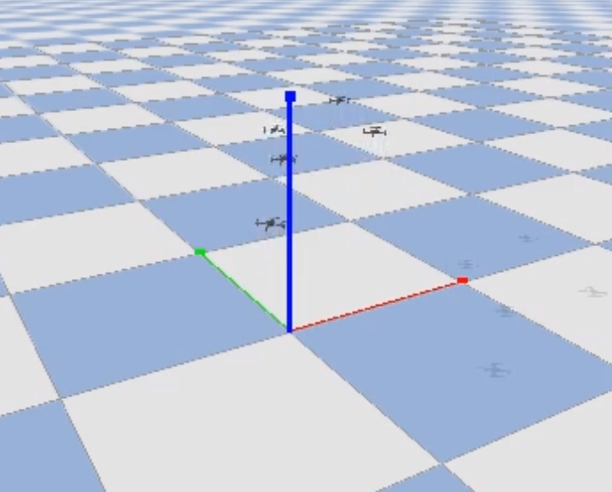

# marl-gym-pybullet-drones
### Multi-agent reinforcement learning environments for quadrotor control in PyBullet, extended with a custom MAPPO implementation and stabilized multi-drone hover training.

This repository is a research-oriented extension of the original `gym-pybullet-drones` framework. It adds centralized-critic MAPPO training, reward shaping for stable hover, and scalable multi-drone experiments using Gymnasium-compatible environments.

<!--  -->


<!--   -->

## Installation

Tested on Ubuntu 22.04.

```sh
git clone https://github.com/khuzema-h/marl-gym-pybullet-drones.git
cd gym-pybullet-drones/

conda create -n drones python=3.10
conda activate drones
```

## Use

### Multi Hover

```sh
cd gym_pybullet_drones/examples/
# Runs multi-agent MAPPO training with 176 parallel environments using 22 worker processes for faster rollout collection
python learn_mappo.py --multiagent true --rollout_batch_size 176 --num workers 22 
```

<!-- ### PID control examples

```sh
cd gym_pybullet_drones/examples/
python3 pid.py # position and velocity reference
python3 pid_velocity.py # desired velocity reference
```

### Downwash effect example

```sh
cd gym_pybullet_drones/examples/
python3 downwash.py
```

### Reinforcement learning examples (SB3's PPO)

```sh
cd gym_pybullet_drones/examples/
python learn.py # task: single drone hover at z == 1.0
python learn.py --multiagent true # task: 2-drone hover at z == 1.2 and 0.7
LATEST_MODEL=$(ls -t results | head -n 1) && python play.py --model_path "results/${LATEST_MODEL}/best_model.zip" # play and visualize the most recent learned policy after training
```

 

### Run all tests

```sh
# from the repo's top folder
cd gym-pybullet-drones/
pytest tests/
```

### utiasDSL `pycffirmware` Python Bindings example (multiplatform, single-drone)

Install [`pycffirmware`](https://github.com/utiasDSL/pycffirmware?tab=readme-ov-file#installation) for Ubuntu, macOS, or Windows

```sh
cd gym_pybullet_drones/examples/
python3 cff-dsl.py
```

### Betaflight SITL example (Ubuntu only)

```sh
git clone https://github.com/betaflight/betaflight 
cd betaflight/
git checkout cafe727 # `master` branch head at the time of writing (future release 4.5)
make arm_sdk_install # if needed, `apt install curl``
make TARGET=SITL # comment out line: https://github.com/betaflight/betaflight/blob/master/src/main/main.c#L52
cp ~/gym-pybullet-drones/gym_pybullet_drones/assets/eeprom.bin ~/betaflight/ # assuming both gym-pybullet-drones/ and betaflight/ were cloned in ~/
betaflight/obj/main/betaflight_SITL.elf
```

In another terminal, run the example

```sh
conda activate drones
cd gym_pybullet_drones/examples/
python3 beta.py --num_drones 1 # check the steps in the file's docstrings to use multiple drones
``` -->


